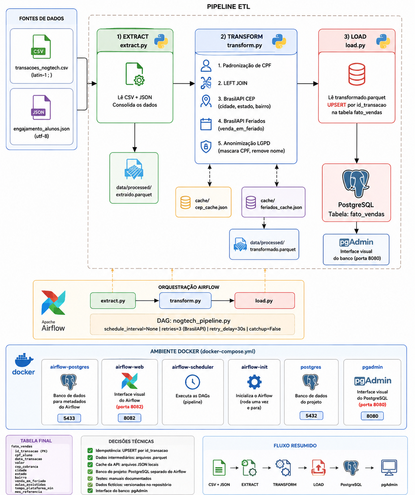

<div align="center">

# NogTech Daily Relatory — Pipeline ETL (Airflow + Docker + PostgreSQL)

#### Projeto acadêmico desenvolvido na disciplina de **Práticas Profissionais em Big Data** — UniCatólica.

</div>
<br>

## Integrantes

| Nome | GitHub |
|---|---|
| Ana Caroline Leonel Brito | github.com/Carol1904 |
| Gustavo Gomes | github.com/Gustavoggomesdev |
| Vinicius Rodrigues Araújo | github.com/Viniciusgt39 |
| Vinicius Gomes de Mello | github.com/ViniciusGGomes |
---

## Sobre o Projeto

A **NogTech** é uma plataforma fictícia de cursos de tecnologia. Este projeto implementa um pipeline de ETL automatizado para consolidar um relatório diário cruzando dados de transações financeiras com dados de engajamento dos alunos.

O pipeline responde à seguinte pergunta de negócio:

> *Quem está pagando pelos cursos, de onde vem geograficamente, em quais datas (incluindo feriados nacionais) e se essas pessoas estão realmente consumindo a plataforma?*


---


## Arquitetura

O pipeline segue o padrão ETL orquestrado pelo Apache Airflow:

```
transacoes_nogtech.csv  ──→
                            extract.py ──→ extraido.parquet
engajamento_alunos.json ──→
                                               ↓
                            transform.py ──→ transformado.parquet
                         BrasilAPI CEP ──↗
                     BrasilAPI Feriados ──↗
                                               ↓
                              load.py ──→ PostgreSQL (fato_vendas)
```

### Ferramentas e decisões

| Ferramenta | Função | Motivo da escolha |
|---|---|---|
| **Apache Airflow** | Orquestração do pipeline | Agendamento, monitoramento visual, histórico de execuções e retries nativos |
| **Python + pandas** | Lógica ETL | Flexibilidade e amplo suporte a manipulação de dados |
| **PostgreSQL** | Destino final dos dados | Banco relacional robusto, suporta UPSERT nativo |
| **pgAdmin** | Interface visual do banco | Visualização dos dados sem necessidade de linha de comando |
| **Docker + Compose** | Containerização | Ambiente reproduzível em qualquer máquina com Docker instalado |
| **BrasilAPI** | Enriquecimento de dados | API pública gratuita com dados de CEP e feriados nacionais |

---

## Containers

O ambiente sobe **6 containers** via Docker Compose:

| Container | Função |
|---|---|
| `postgres` | Banco de dados do projeto — armazena a tabela `fato_vendas` |
| `airflow_postgres` | Banco interno do Airflow — armazena metadados, histórico de execuções e estado das DAGs |
| `airflow_webserver` | Interface visual do Airflow |
| `airflow_scheduler` | Responsável por executar as DAGs |
| `airflow_init` | Inicializa o banco do Airflow e cria o usuário admin — roda uma vez e encerra (comportamento normal) |
| `pgadmin` | Interface visual do PostgreSQL |

---

## Pré-requisitos

- [Docker Desktop](https://www.docker.com/products/docker-desktop) instalado e em execução
- [Git](https://git-scm.com) instalado

---

## Como rodar o projeto

**1. Clone o repositório**

```bash
git clone https://github.com/Viniciusgt39/NogTech-Daily-Relatory.git
cd NogTech-Daily-Relatory
```

**2. Configure o arquivo `.env`**

Copie o arquivo de exemplo e preencha as variáveis:

```bash
cp .env.example .env
```

O arquivo `.env.example` contém todas as variáveis necessárias sem os valores reais. Preencha o `.env` com as credenciais combinadas com o time. Esse arquivo **nunca deve ser commitado** no repositório.

Exemplo de `.env` para desenvolvimento:

```dotenv
DB_HOST=postgres
DB_NAME=nogtech_db
DB_USER=postgres
DB_PASSWORD=postgres
```

**3. Suba o ambiente**

```bash
docker-compose up -d
```

Aguarde todos os containers subirem. O `airflow_init` vai encerrar sozinho após inicializar — isso é esperado.

**4. Acesse as interfaces**

| Interface | URL | Usuário | Senha |
|---|---|---|---|
| Airflow | http://localhost:8082 | `airflow` | `airflow` |
| pgAdmin | http://localhost:8080 | `admin@admin.com` | `admin` |

---

## Configurando o pgAdmin

O pgAdmin não conecta automaticamente ao PostgreSQL — é necessário registrar o servidor uma vez.

**1. Acesse** http://localhost:8080 e faça login

**2. Registre o servidor**

- Clique com botão direito em **Servers** → **Register** → **Server**
- Aba **General**:
  - Name: `NogTech`
- Aba **Connection**:

| Campo | Valor |
|---|---|
| Host | `postgres` |
| Port | `5432` |
| Database | `nogtech_db` |
| Username | `postgres` |
| Password | `postgres` |

- Clique em **Save**

**3. Navegue até a tabela**

```
Servers
  └── NogTech
        └── Databases
              └── nogtech_db
                    └── Schemas
                          └── public
                                └── Tables
                                      └── fato_vendas
```

**4. Visualize os dados**

Clique com botão direito em `fato_vendas` → **View/Edit Data** → **All Rows**

---

## Executando o Pipeline no Airflow

**1.** Acesse http://localhost:8082 e faça login (airflow/airflow)

**2.** Localize a DAG `pipeline_etl_nogtech` na lista

**3.** Ative a DAG pelo toggle à esquerda do nome

**4.** Clique no botão **Trigger DAG** (ícone ▶) para executar manualmente

**5.** Clique no nome da DAG para acompanhar a execução em tempo real no grafo visual

As três tasks devem ficar verdes em sequência:

```
extract >> transform >> load
```

---

## Estratégia de Idempotência

**Estratégia adotada: Chave natural + UPSERT**

O campo `id_transacao` é a chave primária da tabela `fato_vendas`. O pipeline utiliza `INSERT ... ON CONFLICT (id_transacao) DO UPDATE`, garantindo que executar o pipeline múltiplas vezes com os mesmos dados não gera registros duplicados — apenas atualiza os existentes.

Essa estratégia foi escolhida por ser a mais simples de implementar com PostgreSQL e por `id_transacao` já existir naturalmente nos dados de entrada.

---

## Tratamento de Falhas e Resiliência

**Retries no Airflow:** as tasks que dependem da BrasilAPI estão configuradas com `retries=3` e intervalo de 30 segundos entre tentativas. Se a API estiver instável, o Airflow tenta novamente antes de marcar a task como falha.

**Tolerância a falhas no Transform:** cada chamada à BrasilAPI está envolta em `try/except`. Se um CEP retornar 404 ou a API estiver fora do ar:
- A transação é mantida no dataset com `cidade`, `estado` e `bairro` como nulos
- O erro é registrado no log do Airflow com o CEP que falhou
- O pipeline **não é interrompido** — as demais transações continuam sendo processadas

---

## Observações

- O container `airflow_init` encerra após a inicialização. Isso é comportamento esperado, não um erro.
- O arquivo `.env` não deve ser commitado. Use o `.env.example` como referência.
- A BrasilAPI é pública e gratuita. O pipeline implementa cache local em `cache/cep_cache.json` e `cache/feriados_cache.json` para evitar chamadas repetidas à API.
- As credenciais presentes neste projeto são de **ambiente de desenvolvimento** e não devem ser utilizadas em produção.

---

*Disciplina: Práticas Profissionais em Big Data — UniCatólica*
